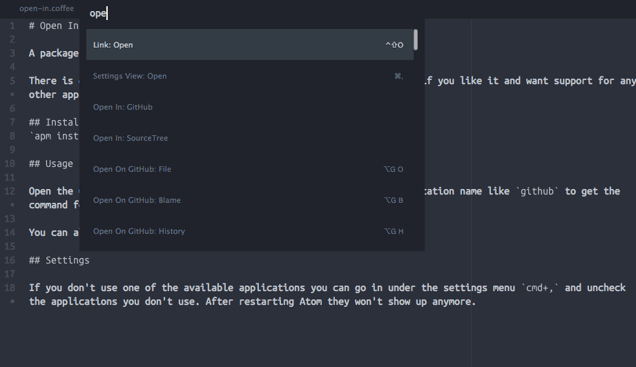

# Open In {app}

A package for opening your project in a git client.

There is currently support for the `GitHub` and `SourceTree` apps, but if you like it and want support for any other app, let me know :)

## Installation
`apm install open-in` or search for it in the package manager.

## Usage

Open the Command Palette `cmd+shift+P` and write `open in` or the application name like `github` to get the command for it.

You can also run it from the **Packages** menu.

## Settings

If you don't use one of the available applications you can go in under the settings menu `cmd+,` and uncheck the applications you don't use. After restarting Atom they won't show up anymore.

